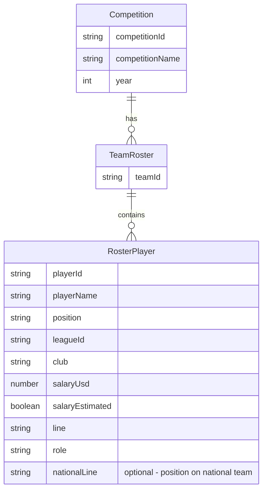

# Data Model

Data structures for `public/data/competitions/` and TypeScript types in `src/types.ts`.

## Schema Overview



## TypeScript Types

```ts
export type Position = 'C' | 'LW' | 'RW' | 'D' | 'G';

export type Line =
  | '1L'
  | '2L'
  | '3L'
  | '4L'
  | 'top4D'
  | 'bottomD'
  | 'starterG'
  | 'backupG';

export type NationalPosition =
  | 'L1'
  | 'L2'
  | 'L3'
  | 'L4'
  | 'D1'
  | 'D2'
  | 'G1'
  | 'G2';

export type Role =
  | 'top6'
  | 'bottom6'
  | 'top4'
  | 'bottom2'
  | 'starter'
  | 'backup';

export interface RosterPlayer {
  playerId: string;
  playerName: string;
  position: Position;
  leagueId: string;
  club: string;
  salaryUsd: number;
  salaryEstimated: boolean;
  line: Line;
  role: Role;
  nationalLine?: NationalPosition; // L1–L4, D1–D2, G1–G2; filled by scripts/update-data.ts --fill-national
}

export interface TeamRoster {
  teamId: string;
  players: RosterPlayer[];
}

export interface Competition {
  competitionId: string;
  competitionName: string;
  year: number;
  teams: TeamRoster[];
}
```

## JSON Layout

Competition data is split across multiple files:

- **Summary:** `public/data/competitions/{competitionId}.json` – competition metadata and team IDs
- **Per-team:** `public/data/competitions/{competitionId}/{teamId}.json` – each team’s roster

Example: `competitions/olympics-2026.json`

**Summary file** `competitions/olympics-2026.json` (metadata + precomputed team metrics for rankings):

```json
{
  "competitionId": "olympics-2026",
  "competitionName": "Winter Olympics 2026",
  "year": 2026,
  "teams": [
    {
      "teamId": "CAN",
      "totalSalary": 25400000,
      "totalScore": 200,
      "playerCount": 23
    },
    {
      "teamId": "USA",
      "totalSalary": 17000000,
      "totalScore": 210,
      "playerCount": 23
    }
  ]
}
```

Run `npx tsx scripts/update-data.ts --fill-summary` to compute and add the `teams` array.

**Overrides** `competitions/{competitionId}/overrides.json` (optional):

Override specific player properties without editing roster JSON. Manual overrides are always applied at load time regardless of generated data; **never overwritten** by update-data or fetch-headshots.

Supported override keys: `headshotUrl`, `line`, `role`, and any other `RosterPlayer` field.

**NHL club lines (event-specific):** Run `npx tsx scripts/fetch-nhl-lines.ts [--competition=<id>]` to fetch lineup data from [DailyFaceoff](https://www.dailyfaceoff.com/teams). Output is written to `scripts/data/{competitionId}/nhl-club-lines.json`. Each event (Olympics, World Championship, etc.) uses its own snapshot; lineups change by season, so World Championship 2026 will use different data than Olympics 2026. Non-NHL clubs default to "1st Line · Top 6".

```json
{
  "FIN": {
    "kakko": {
      "headshotUrl": "https://assets.nhle.com/mugs/nhl/20252026/SEA/8481554.png"
    },
    "laine": {
      "headshotUrl": "https://assets.nhle.com/mugs/nhl/20252026/MTL/8479339.png"
    }
  }
}
```

**Team file** `competitions/olympics-2026/CAN.json`:

```json
{
  "teamId": "CAN",
  "competitionId": "olympics-2026",
  "players": [
    {
      "playerId": "mcdavid",
      "playerName": "Connor McDavid",
      "position": "C",
      "leagueId": "NHL",
      "club": "Edmonton Oilers",
      "salaryUsd": 12500000,
      "salaryEstimated": false,
      "line": "1L",
      "role": "top6"
    }
  ]
}
```

## National Teams

16 national teams in `src/data/nationalTeams.ts`: CAN, USA, SWE, FIN, RUS, CZE, SUI, GER, SVK, LAT, NOR, DEN, AUT, FRA, KAZ, BLR.

## Leagues

League metadata (tier weight, estimated salary range) in `src/data/leagues.ts`: NHL, KHL, SHL, Liiga, DEL, Swiss NL, Czech Extraliga, ICEHL, AHL, Other.
